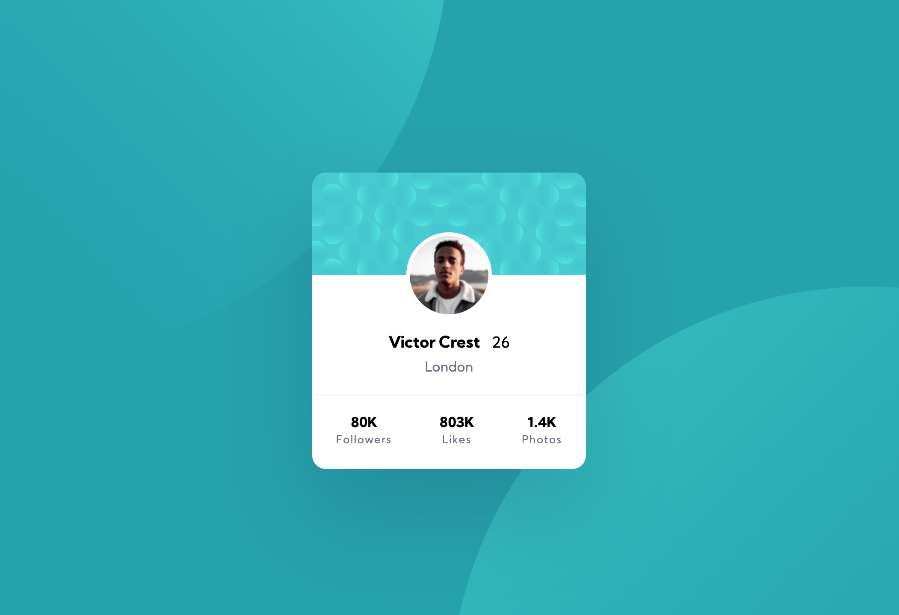

# Frontend Mentor - Profile card component solution

This is a solution to the [Profile card component challenge on Frontend Mentor](https://www.frontendmentor.io/challenges/profile-card-component-cfArpWshJ). Frontend Mentor challenges help you improve your coding skills by building realistic projects. 

## Table of contents

- [Frontend Mentor - Profile card component solution](#frontend-mentor---profile-card-component-solution)
  - [Table of contents](#table-of-contents)
  - [Overview](#overview)
    - [The challenge](#the-challenge)
    - [Screenshot](#screenshot)
    - [Links](#links)
  - [My process](#my-process)
    - [Built with](#built-with)
    - [What I learned](#what-i-learned)
    - [Useful resources](#useful-resources)
  - [Author](#author)

## Overview

### The challenge

- Build out the project to the designs provided

### Screenshot



### Links

- Solution URL: [Frontend Mentor](https://www.frontendmentor.io/solutions/html5-css-X39QcrynV)
- Live Site URL: [Github Pages](https://ziin.github.io/frontendmentor-profile-card-component/)

## My process

### Built with

- Semantic HTML5 markup
- CSS

### What I learned

Positioning the background imagens was my major challenge. This is how I solved it:

```css
  background-image: url(./images/bg-pattern-top.svg), url(./images/bg-pattern-bottom.svg);
  background-repeat: no-repeat, no-repeat;
  background-color: var(--dark-cyan);
  background-position: bottom 45vh right 50vw, top 45vh left 50vw;
```

### Useful resources

- [CSS: background](https://developer.mozilla.org/en-US/docs/Web/CSS/background) - This helped me understand all the css background properties.

## Author

- Frontend Mentor - [@ziin](https://www.frontendmentor.io/profile/ziin)
